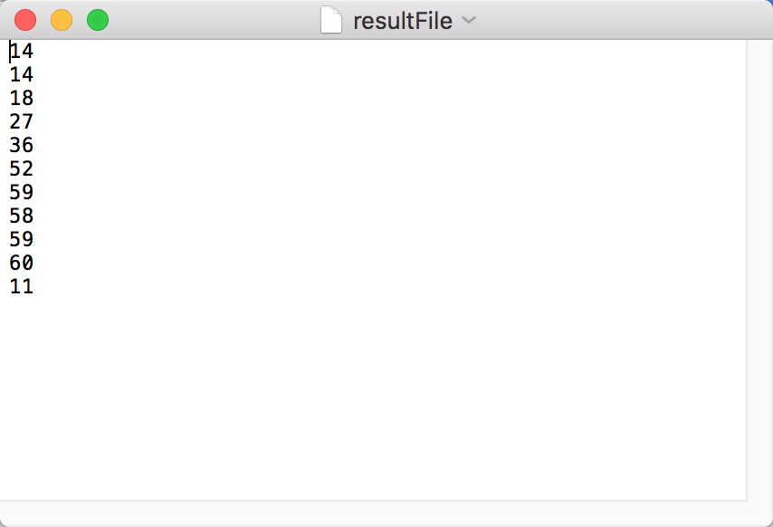

# GPU中间代码分析程序

### 第三部分

​	第三部分的主要工作就是在一个已经完全没有CUDA痕迹的代码中，我们把我们需要提前知道值的变量的相关代码保留下来，这是一部代码优化的工作。

​	因为第三部分的程序逻辑比较复杂，并且根据我们在书写第一部分和第二部分所攒下的教训，我们引入了新的特性。

#### 状态栈

​	程序栈可以帮助我们在回溯到之前的状态。他拥有下面的弹栈和压栈的规则，如果碰到if，while，for，do就分别进入IF，WHILE，FOR，DO，这么几个状态，根据大括号嵌套层级，以及右括号的位置，我们可以知道各个状态的退出位置。IF状态不能进行单纯的退出，在匹配到右大括号的时候还要时刻注意右边是不是还有ELSE。ELSE的弹栈必须和与其配套的IF一起进行。WHILE和IF使用的是同一个状态，因为从语法的构成来说他们几乎一致。FOR和IF的状态也很想，但是我们要注意FOR里面形参的变量相当多，如果特别是哨兵变量（i），这个几乎会在所有的FOR循环的形参中出现，如果我们把这个变量加入关键变量，那么就意味着这个程序中很多无关的循环都会卷入其中，要解决这种问题的主要方法就是去着力寻找DU路径，在我们找到DU路径的识别方法之前，我们先把这些循环全部卷入其中好了。

​	在看DO，这个状态没有形参，他需要和一个和和自己同嵌套等级的WHILE同时出栈。也就是说如果WHILE状态在形参之后之间匹配到了分号，那么WHILE就要和DO一起弹栈。

​	我们仅仅记录状态名是不够的，我们还需要在栈中还需要存其他东西。首先我们需要存储整个头部的行号，对于if来说就是if和if的形参所占有的行号范围，具体的原因的关键变量的勾选有关系。还有就是这个状态的嵌套等级，这个嵌套等级的作用就是为了探求退出状态的时机。当我们找到一个右大括号，并且发现当扣除嵌套等级之后新的嵌套等级和栈顶所对应的嵌套等级一样的时候，我们就可以按照一定的要求退出这个状态并且进行其他操作了。

#### 关键行勾选

​	第三部分的代码优化的核心工作就是进行关键变量的相关行的勾选。在不同的状态下，我们需要不一样的变量的勾选策略。

​	关键变量的主要出现在两个地方一个就是在括号里面当形参，还有一种就是在大括号中。

​	对于出现在括号里面的，我们需要保留整个这一行，这里可能有两种情况，一种就是普通的函数调用，因为我们在前几次扫描的时候就搞定了代码的格式，主要就是右大括号，左大括号，分号之后要有回车，用户自己的回车我们要全部去掉。所以说一个函数的调用将会出现在同一行，也就是说保留了这一行，也就能保留整个函数调用。表达式和函数调用有异曲同工之妙。

​	除了函数调用，还有IF、WHILE、FOR。这些也都是有形参的，如果发现在形参中发现了我们需要的关键变量。那么我们就需要保留整个状态的头部，这个头部就是我们在函数栈中保留的头部行号。其实如果在IF、WHILE、FOR的函数体中发现了关键变量，那么整个头部的行号也要加入到保留行中。所以说IF（不带ELSE的），WHILE（不带DO的），FOR。属于一类情况。

​	还有就是ELSE，因为这个东西是和IF一块弹栈的。所以我们如果在ELSE状态下发现了关键变量，那么我们要做的就是把ELSE和之前的IF同时弹栈，并且IF和ELSE的头部行号全部存起来。

​	还有就是DO这个状态，如果在WHILE的形参中发现了关键变量，那么我们就需要不仅仅保留DO状态的头部，也要保留WHILE状态的头部。

​	对于形参中发现关键变量的情况，我们需要的就是在形参部分完结之后把整个头部记入关键行号。

​	以上就是对于关键行号处理的相关内容。在我们知道了一批关建行之后我们还需要一批关键变量，我们需要对关键行进行扫描，找出新的关键变量，然后通过关键变量找出新的关键行即可。

​	现在还有勾选的问题，因为我们需要一个变量来记录保存IF、WHILE等头部的情况。这就需要我们在状态栈中再加一位，如果如果在一个状态下出现了关键变量，那么我们就要记录这个关键变量的行号，然后把当前状态和在当前状态栈底的状态的头部保留标示位全部由0换成1。包括自身，将自身行号存起来，放到一个数组里面。我们在弹栈的时候我们需要看一看这个栈的节点的那个头部保留标志位是不是1，如果是1，那么我们就需要把这个节点对应的头部行号放到一个数组中。

​	还有一个是比较特殊的问题，那就是DO...WHILE的问题，DO后面的那个WHILE在看是不是需要保留头部行的时候，不仅要看WHILE，还要看DO，如果DO那里要保留头部，那么WHILE也要保留头部。

#### 通过关建行获取新的关键变量

​	经过一段努力，我们使用了初步的关键变量获取了关建行，现在我们需要在这些关建行上进行扫描，以获取新的关键变量，反复进行两个过程，直到我们想要保留的行号不再增加。这个步骤的做法还是比较简单的。我们会获取的行号长这样：

	在Java外壳程序中，我们做的工作就是将相同的行号合并，这个过程主要的想法是先定为这样：

为了保证，我打算使用Java的HashSet来尽可能保证合并效率，Java程序每次从文件中读一个数字，并且把这个数字放到JavaSet中。然后我们要做的工作就是，将JavaSet中的所有数字使用一次快速排序（应该先要把HashSet变成ArrayList，和人认为最快的办法就是使用Hashset，直接放到ArrayList的构造函数中）。然后放到这一次扫描中（获取关键变量是在一次新的扫描中的）。

然后我们对CUDA程序的文本进行再一次的扫描，在这些关建行看看除了系统的保留字是不是还有新的变量名，这里主要有这么几个难点：

- 我们要区分一个单词到底是变量名，还是数据类型名，还是函数名。
- 对于变量名我们保存下来，然后在下一轮“关建行勾选”的时候使用。
- 对于函数名我们其实可以不用理，要留就和变量名一起留，我们要在格式修正的部分多加一些东西，规定在括号的后面追加空格而不是回车，这样子保证函数和函数里面的形参在同一行，从而保证我们在保留了关键变量的同时，包含关键变量的同时，包含了关键变量的函数部分也会保留下来。

